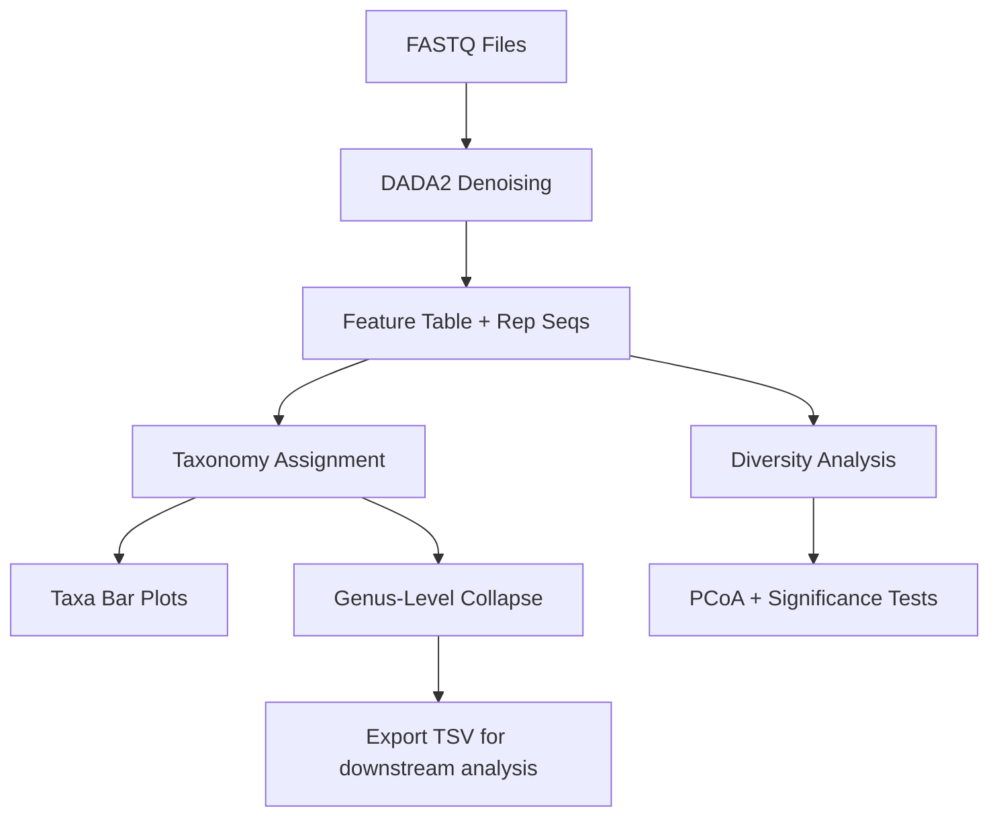

Absolutely — here’s the **fully formatted README.md file** ready for you to copy‑paste directly into your repo.  

---

```markdown
# Exploring the Oral Microbiome for Biomarker Discovery

[](https://qiime2.org)
[](environment.yml)
[](LICENSE)

This repository contains a reproducible pipeline for analyzing oral microbiome data to identify potential biomarkers for early cancer detection. The workflow is built using QIIME2 and includes denoising, taxonomy assignment, diversity analysis, and export-ready visualizations.

---

## 📂 Repository Structure

```
oral-microbiome-cancer-biomarkers/
├── scripts/                # Workflow scripts
│   ├── 01_import_dada2.sh
│   ├── 02_taxonomy.sh
│   ├── 03_diversity.sh
│   └── 04_visualization.sh
│
├── results/                # QIIME2 artifacts & visualizations
├── metadata/               # Sample metadata (metadata.tsv)
├── docs/                   # Documentation, workflow diagrams
├── models/                 # ML models (optional)
├── workflows/              # Pipeline configs (optional)
├── environment.yml         # Conda environment for reproducibility
├── .gitignore              # Ignore temp/large files
└── README.md               # Project overview
```

---

## 🔧 Setup Instructions

1. Clone the repository:
   ```bash
   git clone https://github.com/SnehaPSebastian/oral-microbiome-cancer-biomarkers.git
   cd oral-microbiome-cancer-biomarkers
   ```

2. Create and activate the QIIME2 environment:
   ```bash
   conda env create -f environment.yml
   conda activate qiime2-amplicon-2025.7
   ```

3. Place your sample metadata in `metadata/metadata.tsv`.

---

## 🧪 Workflow Overview



---

## 🚀 Run the Pipeline

### 1️⃣ Import & DADA2
```bash
bash scripts/01_import_dada2.sh
```

### 2️⃣ Taxonomy Assignment
```bash
bash scripts/02_taxonomy.sh
```

### 3️⃣ Diversity Analysis
```bash
bash scripts/03_diversity.sh
```

### 4️⃣ Visualization & Export
```bash
bash scripts/04_visualization.sh
```

---

## 📊 Outputs

- `.qza` → QIIME2 artifacts (data objects)
- `.qzv` → QIIME2 visualizations (viewable at [QIIME2 View](https://view.qiime2.org))
- `.tsv` → Exported tables for R/Python analysis

---

## ✅ Reproducibility

- All dependencies are captured in `environment.yml`.
- Scripts are modular and numbered for clarity.
- Results are stored in `results/` for easy validation.

---

## 👩‍🔬 Authors & Contributions

- **Aisha Hassan Blahayil** 
- **Sneha P Sebastian**
---

## 📄 License

This project is licensed under the MIT License.

---

## 📬 Contact

For questions or collaborations, feel free to open an issue or reach out via GitHub.
```

---
